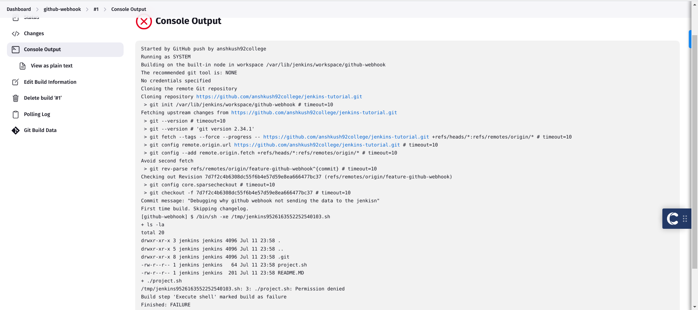

Trying to understand how the jenkins is applied when the user has commited

GithubSCM --> Works whenever there is a github event --> we can specify on which event we want to run the jenkins job

Whenever we push any commit to the reposirtory, it runs the jobs - The job we want to run

The output when we push something on the branch

To avoid this permission denied, we can use the **chmod** command

